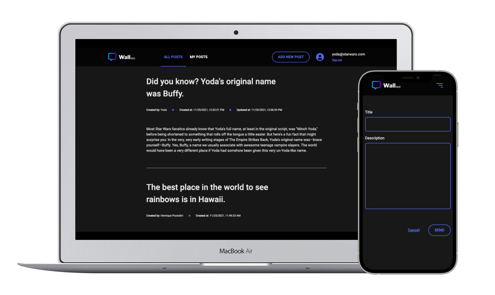

## The Wall App Frontend
<h1 align="center">
  
</h1>



Wall App is an application that allows users to register, login, and write on a wall. They can also edit and delete posts.


## :computer: What's included?

A front end web app created with React.js styled with CSS and Bootstrap that uses [The Wall App API](https://github.com/hpmoreira05/backend_wall_app/) as backend.

## :warning:  Prerequisites and global dependencies

  Ensure that `npm v.6.14.15` is installed and [The Wall App backend](https://github.com/hpmoreira05/backend_wall_app/) is running.

## :vertical_traffic_light:  How to use it?

1. Clone the repository
- `git clone git@github.com:hpmoreira05/frontend_wall_app.git`
- Go to the repository folder you just cloned:
  -`cd frontend`

2. Install dependencies

- `npm install`

3. Create a file `.env` in the root project
- Enter the following values (make sure that REACT_APP_URL is the same that you are using to run the [server](https://github.com/hpmoreira05/backend_wall_app/)):
``` 
REACT_APP_URL=http://localhost:5000
```
4. Start the project
- `npm start`

## 📹 Demo


## :cloud: Deployment
Host: [Heroku](https://www.heroku.com)

You can access The Wall App using your computer or your mobile from here: [The Wall App API](https://wall-app-hpmoreira05-back.herokuapp.com/)
